# What Do I Paint?

One of my creative hobbies is miniature painting. Talking with other people who share my love for the hobby,
we wanted to have a tool that would help us with the dreaded _pile of shame_ AKA all the unfinished projects you have at home.

I saw the opportunity to hone my abilities as a full-stack developer and make the tool myself.

[See the back-end repository.](https://github.com/MaraScampini/WhatDoIPaint)

This website has two main purposes: to motivate you to paint every day using streaks that update whenever you mark some project
as having been painted that day, and to help you choose between the multitude of unfinished (or even un-started) projects
you have lying around using a random picker that accepts some parameters.

It also is a kind of painting diary where you can record everything you do, upload pictures of your in-progress and finished minis
and track your progress in each project.

The website is fully deployed in Railway:

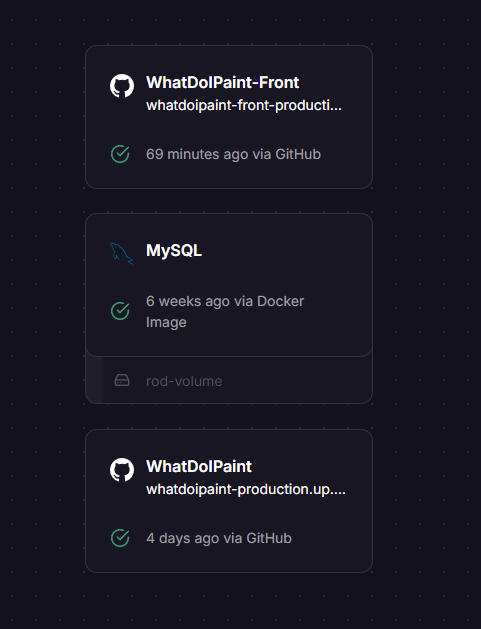

For this front-end part of the project I used React with Vite. 

I did a minimal, retro design with a reduced color palette that would make it easier for me to work and I used Figma for this first phase.

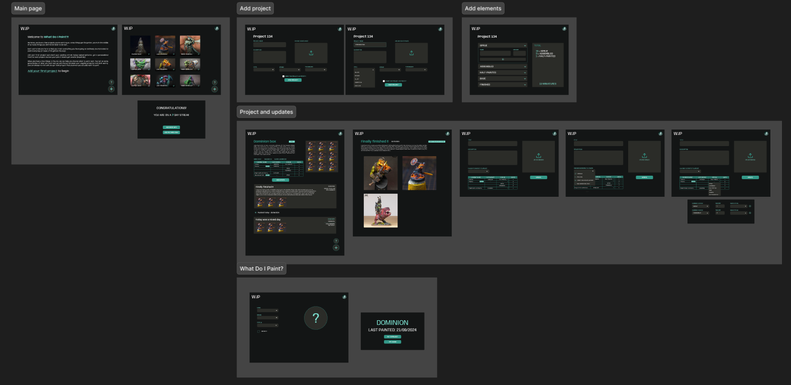

Once this was done, I jumped into VS Code and refreshed my React knowledge (I have been working as a back-end for almost two years, so I had to do quite the refresher here) and took this as an opportunity to try things I hadn't before, in this case I integrated Tailwind CSS and React-Query in my project and found them very useful.

Some screenshots of the application:

The main feed, where the user can see their projects, filter and search. The projects are ordered by priority (toggled with the little star in the upper right of each project) and by last update.

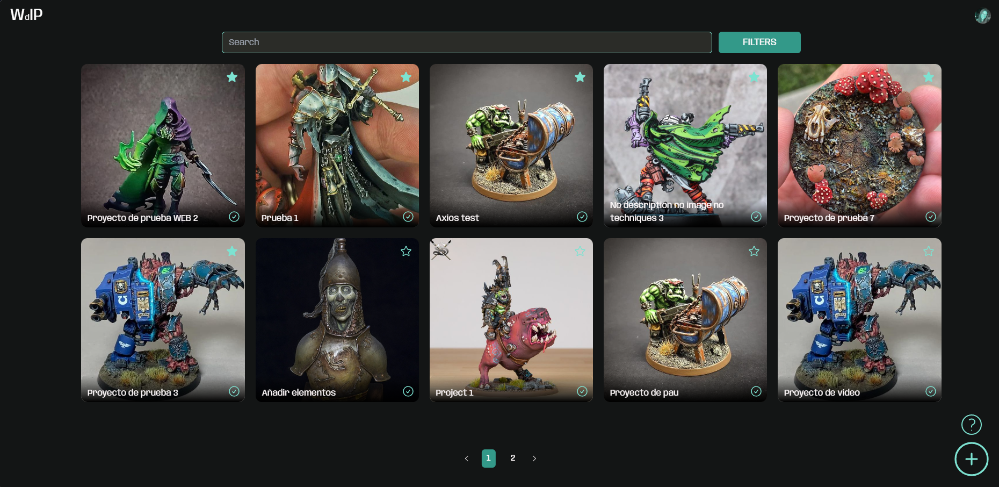

The little tick to the lower right in each project makes a quick update and gets this popup, which informs you of your streak and allows you to do a full update, just pictures or just leave it as is.

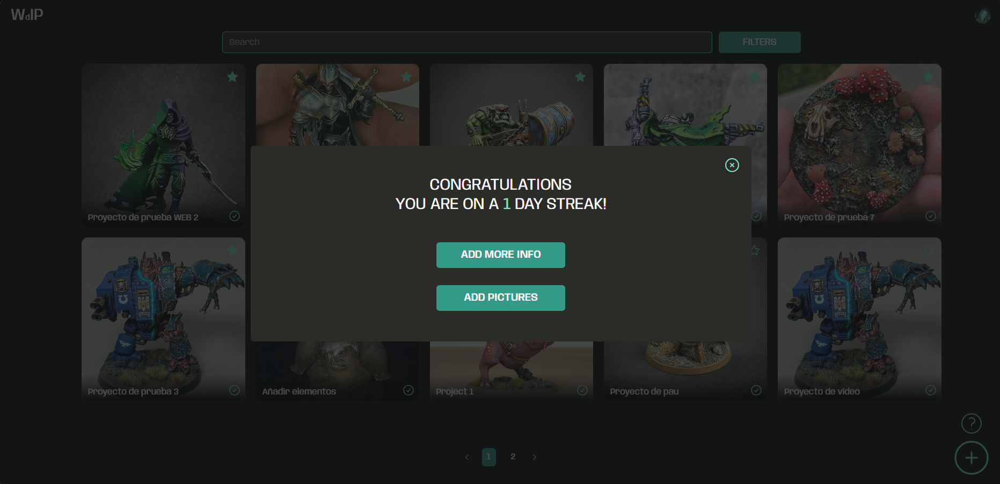

If the user wants to add a full-fledged update, they get redirected to this page, where they can write, add images and choose which elements or squads from their project they're updating and set the status for each one. If they are updating a squad, they can set the units separately in different status.

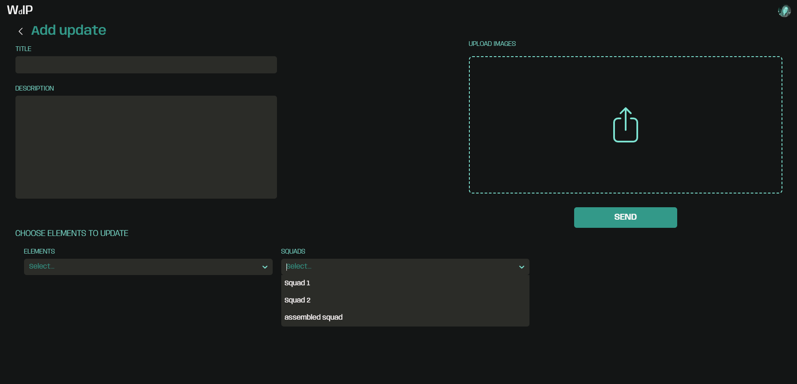

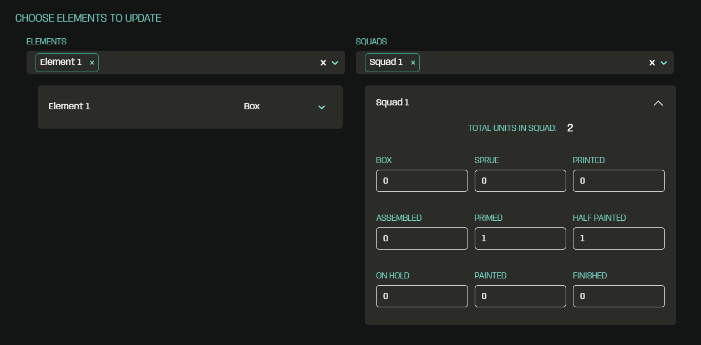

Each project has its own feed with details about the project, a gallery and an update gallery too:

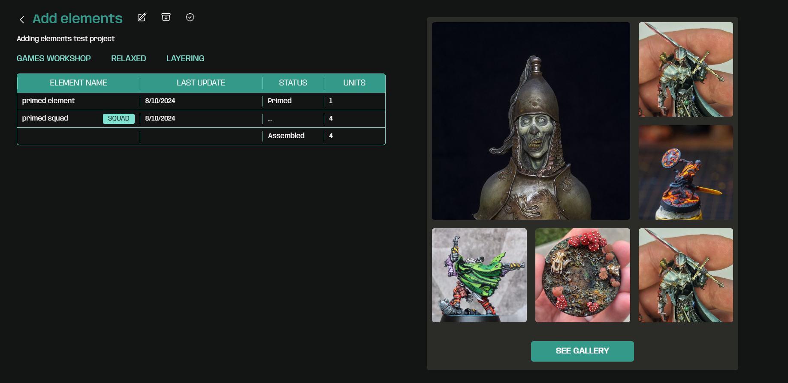

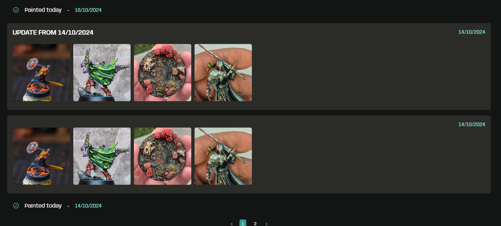

Projects can be archived to be used at a later date but not appear in the main feed and can be marked as finished:

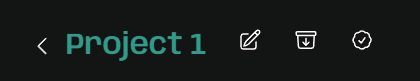

When creating a project the user can select the level at which they want to paint the project, the brand of the miniatures (or 3D printed) and the techniques they want to practice with it. All of these can be later used to filter projects in the main feed and in the randomizer.

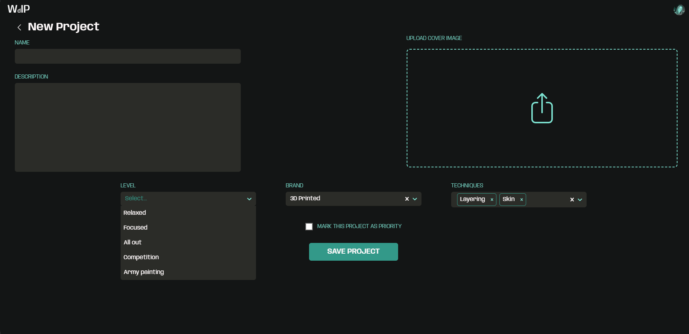

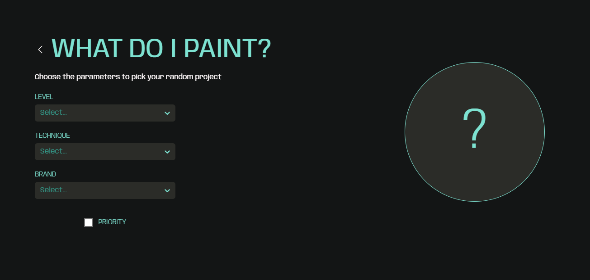

This is an ongoing project and I want to implement some more features:

* Social - users can see the feeds from their friends' projects and can make theirs public for them to see
* Profile - users can upload their profile picture and edit their information for other users to see

